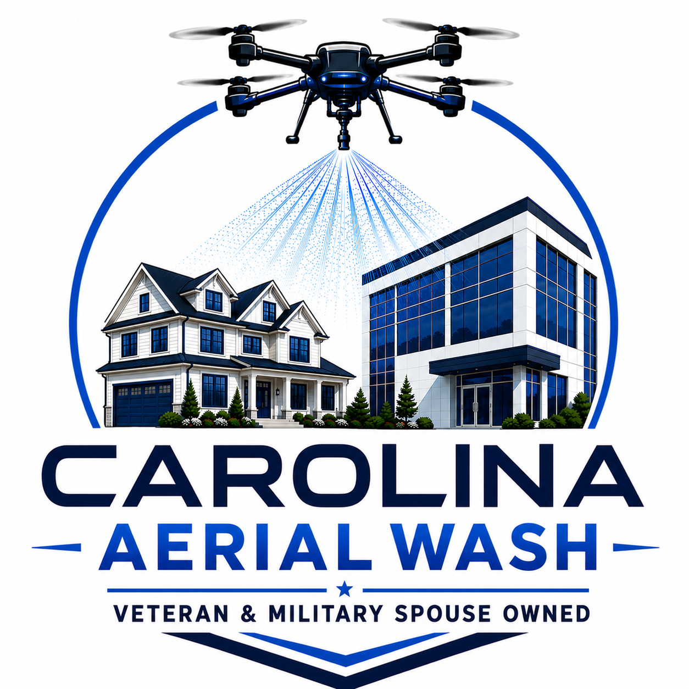
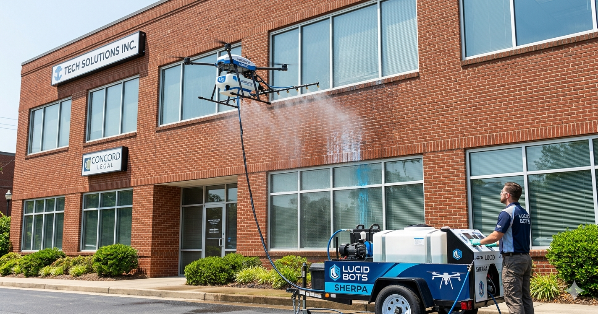
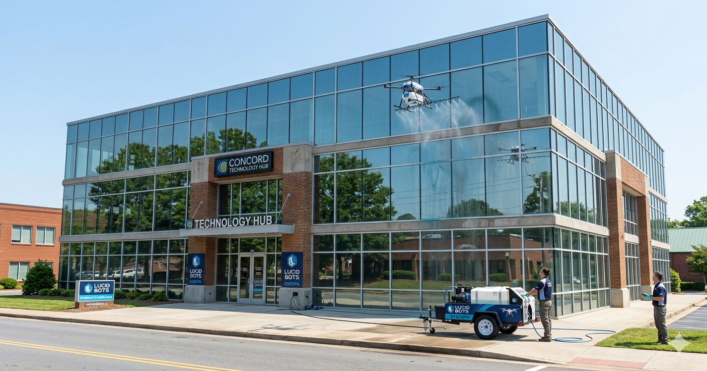
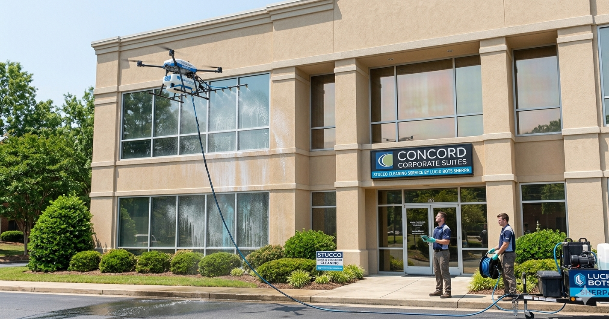
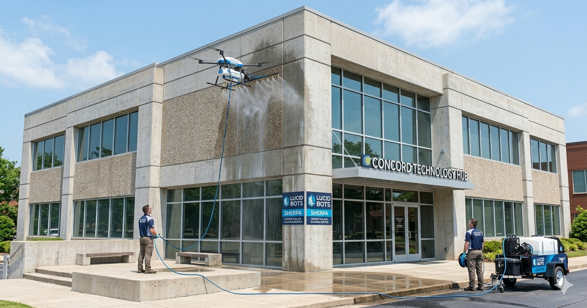

{fig-align="center" width="300px"}

```{=html}
<div class="card-grid">

  <div class="card shadow-sm">
    
    <div class="card-body">
      <h5 class="card-title">Services</h5>
      <p class="card-text">Learn about the professional aerial wash services we offer.</p>
      <a href="services.html" class="stretched-link"></a>
    </div>
  </div>

  <div class="card shadow-sm">
    
    <div class="card-body">
      <h5 class="card-title">Gallery</h5>
      <p class="card-text">Browse photos of our work from past projects.</p>
      <a href="gallery.html" class="stretched-link"></a>
    </div>
  </div>

  <div class="card shadow-sm">
    
    <div class="card-body">
      <h5 class="card-title">About Us</h5>
      <p class="card-text">Meet the veteran-owned small business behind Carolina Aerial Wash.</p>
      <a href="about.html" class="stretched-link"></a>
    </div>
  </div>

  <div class="card shadow-sm">
    
    <div class="card-body">
      <h5 class="card-title">Contact</h5>
      <p class="card-text">Get in touch to request a quote or ask us a question.</p>
      <a href="contact.html" class="stretched-link"></a>
    </div>
  </div>

</div>
```
